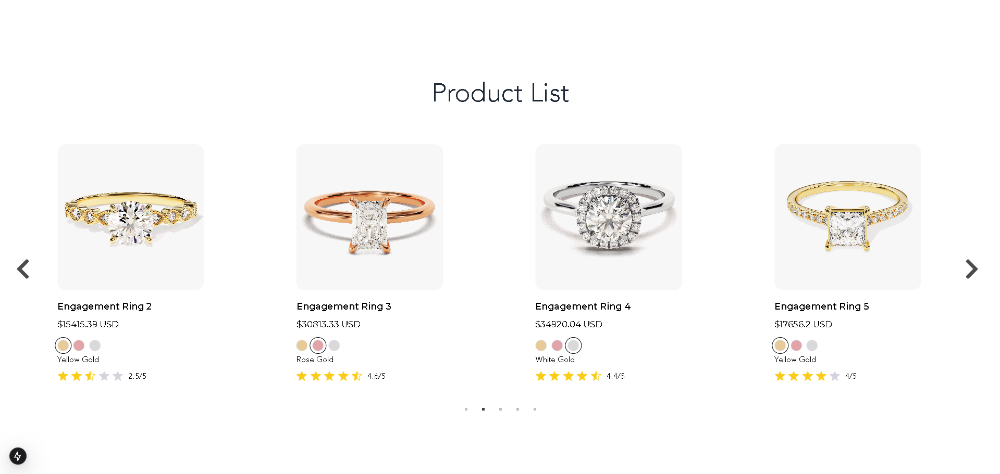

This is a [Next.js](https://nextjs.org) project bootstrapped with [`create-next-app`](https://github.com/vercel/next.js/tree/canary/packages/create-next-app).


## info
This is a product listing application that consists of two main parts: a backend RESTful API
and a frontend interface. The backend will provide product information to the frontend,
which should display the products information. The product/s price is calaculated according to real time gold price via an external API at [goldapi.io](https://www.goldapi.io/).
<br>Below is a screenshot:


## Getting Started
First, install the required dependencies:
```bash
npm install 
```
Then, run the development server:

```bash
npm run dev
```

Open [http://localhost:3000](http://localhost:3000) with your browser for the frontend UI.

Open [http://localhost:3000/api/proucts](http://localhost:3000/api/products) with your browser to call the backend API. You can also specify query parameters for filtering after the ? sign


